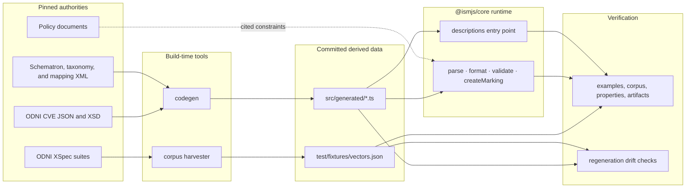
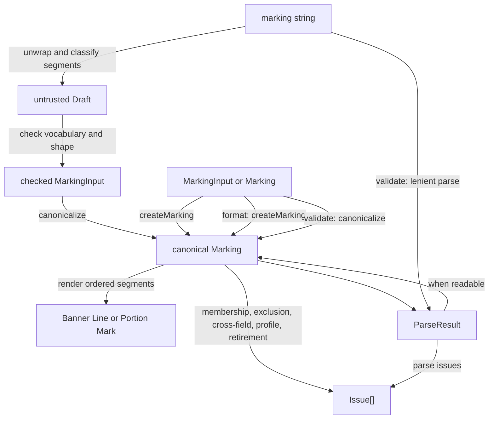
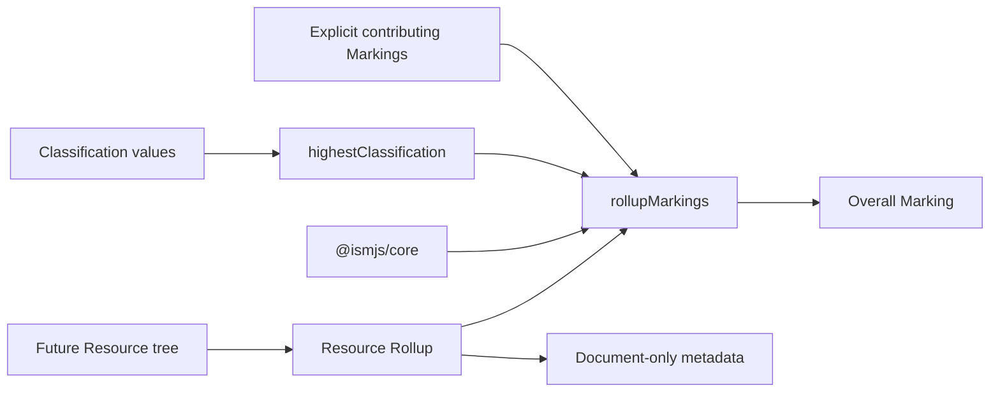
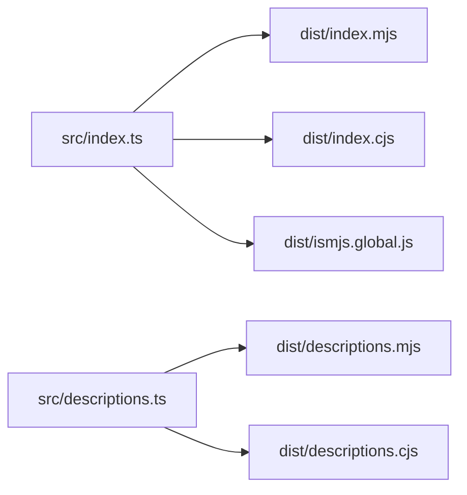

# Architecture

ismjs is a TypeScript monorepo whose only current package, `@ismjs/core`, is a
dependency-free codec for Information Security Markings. It turns Banner Lines and
Portion Marks into a canonical domain value, renders that value back into either syntax,
and reports the subset of ODNI rules that can be evaluated without the surrounding
document.

This document describes how the repository is divided and how data moves through it.
For domain terms, start with [CONTEXT.md](./CONTEXT.md). For the reasoning behind durable
choices, see [docs/adr/](./docs/adr/).

## System shape

The repository separates pinned authority material, build-time extraction, runtime code,
and evidence. Only the runtime package is published.

The arrows are intentionally one-way:

- `references/` is source material and never a runtime dependency.
- `packages/core/scripts/` may read `references/` and write generated files.
- `packages/core/src/` may import generated modules but never build-time scripts.
- Generated source and corpus fixtures are committed so authority changes have a
  reviewable diff.
- Tests may cross all these boundaries to verify provenance and published behavior.

## Runtime model

### The central value

`MarkingInput` is the caller-facing shape. Its arrays may be empty, duplicated, or out of
order. `Marking` is the internal guarantee: it contains only facts expressible in a
marking string, has no empty optional arrays, and stores multi-valued fields in Canonical
Order. `Canonical<T>` and `CanonicalNonEmpty<T>` are phantom brands minted only by the
normalization boundary.

`Marking` is deliberately narrower than the full ISM attribute set. Document-only facts,
including the Classification Authority Block, are outside this codec. This boundary is
what makes rendering and parsing genuine inverses except for the explicitly tested loss
categories described in the README.

### Public operations

The four primary operations share the `Marking` model but answer different questions.
They do not call one another merely to reuse policy.

#### `parse`

Parsing is a staged trust boundary:

1. `parse.ts` removes Portion Mark wrappers and splits `//` segments.
2. `read.ts` classifies each unlabeled segment by whole-token vocabulary matches and
   writes plain strings into a `Draft`.
3. `check.ts` proves that the draft's values are admitted before they acquire token
   types.
4. `normalize.ts` deduplicates and establishes Canonical Order.
5. Strict parsing compares the supplied sequence with the required Canonical or
   Presentation Order.

Malformed and unknown input is expected, so failure is a `ParseResult`, not an
exception. A successful parse means the string was understood; it does not mean every
validation rule permits the result.

#### `format`

`format.ts` first passes fields through `createMarking`, then concatenates independently
rendered segments from `segments.ts`. Segment order is explicit policy. Individual
renderers own syntax-specific Consumption, spelling, and Presentation Order without
mutating the canonical value.

Rendering and parsing intentionally keep separate control flow. Optional and overlapping
segments make parsing a classification problem, while rendering already knows every
field's identity. [ADR 0005](./docs/adr/0005-parsing-and-rendering-do-not-share-a-segment-table.md)
records why a shared descriptor table would hide rather than remove that asymmetry.

#### `createMarking`

`createMarking` is the public construction boundary over `canonicalize`. It deduplicates,
orders, omits empty fields, and rejects dependent values that cannot be represented, such
as an invalid `HVCO`/channel combination. The canonical brand lets downstream code rely
on stored order without defensive sorting.

#### `validate`

Validation is deliberately separate from parsing and formatting:

- a string is parsed leniently so an ordering warning does not prevent other findings;
- plain fields are canonicalized without first requiring callers to construct a
  `Marking`;
- membership, mutual exclusion, generated cross-field rules, written rules, optional
  deployment profiles, and date-sensitive retirement are evaluated in stable order.

`validate.ts` is the orchestration seam, not a generic rule engine. Each rule shape stays
with the module representing its domain semantics. Validation returns all applicable
`Issue` values because callers correct a marking as a whole.

### Runtime module boundaries

| Area                | Principal modules                                                               | Responsibility                                                           |
| ------------------- | ------------------------------------------------------------------------------- | ------------------------------------------------------------------------ |
| Public surface      | `index.ts`, `descriptions.ts`                                                   | Stable package entry points and exported types                           |
| Domain value        | `marking.ts`, `canonical.ts`, `normalize.ts`                                    | Marking shape, kind, ordering guarantees, and construction               |
| Reading             | `parse.ts`, `read.ts`, `check.ts`, `draft.ts`                                   | Syntax decomposition, segment classification, and admission              |
| Rendering           | `format.ts`, `segments.ts`, `second-line.ts`                                    | Assembly of Banner Lines and Portion Marks                               |
| Shared syntax       | `syntax.ts`, `spelling.ts`, `entity-spelling.ts`, `compartment.ts`, `dissem.ts` | Separators and focused transformations used by reader or renderer        |
| Validation          | `validate.ts`, `admit.ts`, `cross-field.ts`, `written-rules.ts`, `profile.ts`   | Rule orchestration and distinct rule semantics                           |
| Diagnostics         | `issue.ts`                                                                      | Named issue construction, codes, severity, and parse results             |
| Generated authority | `generated/*.ts`                                                                | Tokens, order, spellings, descriptions, rules, memberships, and versions |

Field knowledge is kept in the narrowest module that owns its meaning. Similar-looking
field lists are not automatically one abstraction; admission, ordering, assembly, and
validation encode different facts and need different types. See
[ADR 0004](./docs/adr/0004-marking-field-knowledge-remains-explicit.md).

## Planned Rollup boundary

`@ismjs/rollup` is planned as a separate package over canonical `Marking` values. It
does not widen the codec or require an XML document merely to combine an explicit set of
contributors.

Marking Rollup is a pure whole-batch derivation. A future Resource capability owns tree
traversal, contribution selection, and document-only fields, then delegates its explicit
contributor set to the Marking kernel. This direction avoids making a lossy many-to-one
operation part of the strict single-Marking codec and avoids inventing a Resource model
inside an algorithm.

The first target profile is USA-owned output. Unanimous contributor ownership can be
preserved; mixed ownership requires an explicit Rollup Target Ownership. Unsupported
authority gaps fail instead of silently dropping security facts. See the
[Rollup capability design](./docs/rollup.md) and
[ADR 0008](./docs/adr/0008-marking-rollup-is-a-separate-package-and-resource-rollup-remains-separate.md).

## Authority and generation

The runtime contains integration logic, not hand-transcribed controlled vocabularies.
`packages/core/scripts/codegen.ts` coordinates focused readers and emitters:

| Authority input               | Generated output                  | Runtime use                                                           |
| ----------------------------- | --------------------------------- | --------------------------------------------------------------------- |
| CVE JSON plus XSD arbitration | `vocab.ts`, `ismcat.ts`, `cui.ts` | Literal unions, pattern terms, descriptions, retirement metadata      |
| Ordered CVEs                  | `order.ts`                        | Canonical dissemination order by Marking Kind                         |
| `BannerMapping.xml`           | `banner.ts`                       | Portion-token to Banner Line spelling                                 |
| Schematron rules              | `rules.ts`                        | Membership, exclusion, deprecation, and harvestable cross-field rules |
| Tetragraph taxonomy           | `tetragraph.ts`                   | Coalition membership and entity expansion                             |
| Package metadata              | `spec-version.ts`                 | Exported authority version                                            |
| All vocabulary builders       | `descriptions.ts`                 | Separate display-data entry point                                     |

JSON supplies values and descriptions, while XSD distinguishes literal tokens from
regular-expression terms where the JSON is lossy. Rules that fit supported table shapes
are generated. Rules whose XPath semantics cannot be represented faithfully remain
explicit in `written-rules.ts` and retain their official IDs.

The separate `harvest.ts` pipeline reads ODNI XSpec scenarios and creates the committed
golden corpus. Unsupported scenarios remain in the corpus with a named skip reason, so
scope gaps stay measurable instead of disappearing from test counts.

## Verification architecture

The tests use several independent kinds of evidence:

- focused unit tests pin parsing, rendering, normalization, profiles, and individual
  rule behavior;
- official XSpec vectors compare output with the vendored ODNI implementation;
- independently collected valid Portion Marks exercise inputs not produced by this
  library;
- property tests generate Markings from the same vocabularies and enforce the
  round-trip law over combinations the corpus does not contain;
- explicit loss tests enumerate every known case where a string cannot carry the full
  input value;
- artifact tests load ESM, CommonJS, and the global bundle as consumers do;
- drift checks regenerate source and fixtures and fail when committed outputs differ.

The fast `check` command covers formatting, linting, types, and source tests.
`check:full` adds builds, coverage thresholds, generated-data drift, corpus drift, and
package-shape validation.

## Published artifacts

`tsdown` builds two public entry points and three consumption formats:

The descriptions entry point is separate because labels are display data and are not
needed by the codec. Keeping them out of the self-contained global bundle matters for
air-gapped consumers. The package declares no runtime dependencies and all entry points
are side-effect free.

## Where changes belong

Use the ownership boundary, not file-name similarity, to place a change:

| Change                                                                      | Start here                                                                                                 |
| --------------------------------------------------------------------------- | ---------------------------------------------------------------------------------------------------------- |
| Vocabulary, order, description, mapping, or supported rule changed upstream | Update `references/`, then the relevant generator; never edit `src/generated/`                             |
| A marking string is read incorrectly                                        | `parse.ts` for assembly, `read.ts` for segment identity, then the focused spelling/expansion helper        |
| A valid Marking renders incorrectly                                         | `format.ts` for segment order or wrappers; `segments.ts` and focused helpers for segment content           |
| Canonical storage is wrong                                                  | `normalize.ts`, `canonical.ts`, and the governing generated order                                          |
| A legal relationship is accepted or rejected incorrectly                    | `validate.ts` orchestration, then `cross-field.ts`, `written-rules.ts`, or `profile.ts` by rule meaning    |
| A public capability changes                                                 | `index.ts`, README examples, package artifact tests, and an ADR if the decision is durable and non-obvious |
| A specification area needs document context rather than a Marking           | Treat it as a wider domain type or future package; do not widen `Marking` casually                         |

## Architectural constraints

The current design is held together by a few constraints:

1. Vendored authorities, not recollection or live web data, determine generated runtime
   facts.
2. `Marking` contains only string-expressible facts and is canonical by construction.
3. Parsing, formatting, and validation answer separate questions and remain separate
   public operations.
4. Generated data flows into runtime code; runtime code never reaches back into the
   generators or `references/`.
5. Parsing and rendering may share focused transformations but not a false symmetric
   grammar abstraction.
6. Validation rule families remain distinct behind one public orchestration seam.
7. Deliberate information loss and unsupported authority scope are counted and tested,
   never silently skipped.
8. Marking Rollup remains outside the codec, consumes canonical Markings as a whole
   batch, and does not absorb Resource traversal or document-only metadata.

Changes that intentionally alter one of these constraints should update this document
and normally add or amend an ADR.
