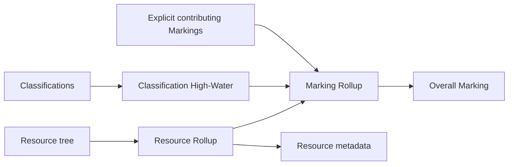

# Rollup capability design

Status: planned

This document defines the first `@ismjs/rollup` capability. It is an implementation plan,
not a claim that Rollup currently ships and not a declaration that ismjs is ready for a
1.0.0 release. [ADR 0008](./adr/0008-marking-rollup-is-a-separate-package-and-resource-rollup-remains-separate.md)
records the durable boundary choices.

## Capability boundary

Three operations are deliberately distinct:

- **Classification High-Water** returns the highest Classification represented by an
  explicit set of Classification values.
- **Marking Rollup** derives one overall Marking from an explicit set of contributing
  Markings.
- **Resource Rollup** discovers contributors in a Resource tree and derives both an
  overall Marking and document-only metadata.



The first package implements the first two operations. Resource Rollup is a separate
design topic because contribution selection, XML transport, the Classification Authority
Block, Notices, Need-To-Know, and NATO High-Water Values are not `Marking` facts.

## Public contract

The intended API is:

```ts
function highestClassification(
  classifications: Iterable<Classification>,
): Classification | undefined

function rollupMarkings(
  markings: Iterable<Marking>,
  options?: {
    readonly targetOwnership?: RollupTargetOwnership
  },
): RollupResult
```

`Classification` is the classification domain exposed by the post-NATO core model.
`RollupTargetOwnership` contains a nonempty `ownerProducer` and optional `joint` flag.
Callers parse strings or construct Markings through `@ismjs/core` before Rollup; this
package does not accept strings or `MarkingInput`.

Conceptually, the result is:

```ts
type RollupResult =
  | {
      readonly ok: true
      readonly marking: Marking
      readonly issues: readonly RollupIssue[]
    }
  | {
      readonly ok: false
      readonly issues: readonly RollupIssue[]
    }
```

Warnings can accompany a valid result. Any error produces no partial Marking. Expected
domain failures never throw.

`highestClassification` returns `undefined` for an empty iterable. It is associative,
commutative, and idempotent, with sensitivity order `TS > S > C > R > U`. It reports the
domain fact and therefore preserves `R`.

## Inputs and validation

`rollupMarkings` accepts any finite iterable, materializes it once, removes duplicate
Markings, and operates on the whole batch. An empty input fails with `no-contributors`.

The package runs context-free core validation over every contributor and over the result:
membership, mutual exclusion, cross-field rules, and written Marking rules. It does not
invent a Resource creation date or apply a deployment Profile. Date- and Profile-sensitive
validation remains a caller or Resource responsibility.

An invalid contributor is identified by the canonical Marking in structured issue
context, not by an order-dependent array index. Identical findings are deduplicated, and
issues have stable ordering by severity, code, field, and values. Core findings remain
available as structured causes beneath Rollup-specific issue codes.

## Rollup Target Ownership

Owner-Producer is not a union of contributor origins. The same sources can support a
USA-owned derivative, a foreign-owned derivative, or a joint work depending on who
produces the target.

The initial ownership algorithm is:

1. When every contributor has identical `ownerProducer` and `joint`, infer that ownership.
2. When contributor ownership differs, require `targetOwnership`.
3. When an explicit target equals unanimous contributor ownership, accept it silently.
4. When an explicit target overrides unanimous ownership, accept it with a warning.
5. Preserve applicable foreign and NATO contributor origins through FGI derivation.
6. Fail when the resolved target is outside the supported target profile.

The first profile supports USA-owned targets. NATO-owned targets are a separately
researched follow-on after NATO support exists in core. Arbitrary foreign target ownership
is not generalized from the USA rules.

The legacy `ismjs-rollup` inferred ownership more aggressively: any USA-only contributor
forced USA ownership, otherwise it intersected ownership sets, with special NATO cases.
Only identical JOINT ownership had focused test coverage. The narrower rule above is an
intentional model correction.

## Field policy

Every `Marking` field has an exhaustive disposition. Adding a core field must force an
explicit reducer, rejection, or documented non-contribution decision at compile time.

| Field                      | Initial USA-target rule                                                           |
| -------------------------- | --------------------------------------------------------------------------------- |
| `classification`           | Classification High-Water; promote `R` to `C` for USA output                      |
| `ownerProducer`, `joint`   | Infer or copy Rollup Target Ownership                                             |
| `SCIcontrols`              | Canonical distinct union                                                          |
| `specialAccessPrograms`    | Canonical distinct union of projected SAP Program Expressions                     |
| `atomicEnergyMarkings`     | Canonical distinct union; remove `UCNI` and `DCNI` from classified output         |
| `disseminationControls`    | Distinct union followed by the suppression and participation rules below          |
| `releasableTo`             | Intersection across FD&R participants after authority-defined coalition expansion |
| `displayOnlyTo`            | Unsupported authority gap; fail when it can affect output                         |
| `FGIsourceOpen`            | Union open sources and applicable foreign or NATO contributor origins             |
| `FGIsourceProtected`       | Any protected source suppresses open sources and collapses to protected `FGI`     |
| `nonICmarkings`            | Union with authority-defined `SBU-NF` and `LES-NF` projection                     |
| `nonUSControls`            | Canonical distinct union                                                          |
| `cuiBasic`, `cuiSpecified` | Canonical distinct union                                                          |
| `secondBannerLine`         | No pinned Rollup rule; fail when present                                          |
| `handleViaChannels`        | No pinned Rollup rule; fail with its dependent `HVCO` control                     |

SAP support depends on the settled projected `specialAccessPrograms` field in core. It
unions the string-expressible program facts; it does not reconstruct SAR authority or
required classification that a Marking does not carry.

CUI union is supported even though the reference Rollup XSLT omits it. Schematron rules
ISM-ID-00502 and ISM-ID-00503 explicitly require every contributing CUI Basic and CUI
Specified category at Resource level.

### Dissemination and releasability

FD&R participation is a field-level question inside Marking Rollup. An uncaveated `U`
contributor does not constrain release. A contributor carrying releasability,
`displayOnlyTo`, `NF`, `RELIDO`, or related non-IC restrictions does.

The initial rules reproduce the pinned USA behavior:

- Explicit `NF` suppresses `REL`, `EYES`, `RELIDO`, and `DISPLAYONLY`.
- If not every FD&R participant carries an applicable release control, synthesize `NF`.
- `REL` or `EYES` survives only with a common country set containing USA and at least
  one additional entity; otherwise it collapses to `NF`.
- A mixture of `REL` and `EYES` resolves to `REL` when the common set is sufficient;
  all-EYES participation retains `EYES`.
- `RELIDO` survives only when every FD&R participant carries it.
- Mixed `OC` portions retain `OC` but drop `OC-USGOV` when not universal.
- Classified output drops `FOUO`; `DSEN` also drops `FOUO` from unclassified output.
- `SBU-NF` and `LES-NF` can synthesize `NF` and project to `SBU` and `LES`.
- Other dissemination controls form a canonical distinct union.

Coalition tetragraph expansion comes from generated authority data. A successful
nonempty country intersection is ordinary Rollup, not a warning.

## Diagnostics and information loss

`RollupIssue` has a stable code, severity, message, optional field, and structured
context. The initial error families include:

- `no-contributors`
- `invalid-contributor`
- `target-ownership-required`
- `unsupported-target-ownership`
- `unsupported-field`
- `invalid-result`

Warnings identify exceptional, authority-required information loss or projection:

- `classification-promoted`
- `dissemination-suppressed`
- `releasability-collapsed`
- `fgi-collapsed`
- `atomic-energy-dropped`
- `non-ic-projected`
- `target-ownership-overrides-unanimous`

Ordinary maximum, union, canonical ordering, and successful intersection do not warn.
Contributor validation warnings remain distinguishable from Rollup loss warnings.

## Authority and conformance

Evidence is interpreted in this order:

1. Published policy and Schematron establish required semantics.
2. Passing XSpec scenarios and executable XSLT establish reference behavior.
3. Pending XSpec scenarios record unresolved intent but cannot authorize behavior alone.
4. An ismjs extension beyond those sources requires an ADR and an explicit conformance
   warning.

The initial conformance statement is narrow: `@ismjs/rollup` supports USA-target Marking
Rollup for the field matrix above under the pinned ODNI edition. It does not claim full
ODNI Resource Rollup.

`displayOnlyTo` is the known immediate authority gap. Its three reference XSpec scenarios
are pending, and the supplied Rollup XSLT can retain `DISPLAYONLY` without emitting the
required entity list. The first package fails rather than guessing the intended
intersection.

## Behavioral guarantees

Marking Rollup is:

- pure and synchronous;
- deterministic for a given package and authority version;
- independent of contributor order; and
- insensitive to duplicate Markings.

It is batch-only. The API does not expose a binary `combine` operation and does not
promise associativity. Intermediate results can discard contributor ownership,
releasability lists, FGI identities, AEA values, and non-IC suffix information required
to reproduce the same result or diagnostics after regrouping.

The implementation accepts any finite iterable, materializes it once, and uses linear
passes plus field-local set operations. It imposes no arbitrary contributor limit. A
large synthetic test or benchmark guards against accidental quadratic behavior without
promising hardware-specific latency.

## Package shape

`@ismjs/rollup` is independently versioned from `@ismjs/core`, beginning at `0.1.0`. It
declares a pre-1.0-compatible core peer dependency plus a workspace development
dependency. The package has one public entry point; individual field reducers remain
internal.

Published artifacts mirror the repository's consumption targets:

- ESM;
- CommonJS;
- declaration files; and
- `ismjs-rollup.global.js`, a browser plugin artifact loaded after the core global.

The package is side-effect-free and has no runtime dependency other than core.

## Verification plan

Verification combines independent evidence:

1. Harvest supported ODNI Rollup XSpec scenarios into committed fixtures.
2. Test Schematron-derived rules directly, including CUI union.
3. Review legacy `ismjs-rollup` cases individually as secondary regression evidence.
4. Add property tests for Classification High-Water associativity, commutativity, and
   idempotence.
5. Add property tests for Marking Rollup permutation and duplicate invariance.
6. Test every unsupported field, target, invalid contributor, empty input, loss warning,
   and authority gap.
7. Regenerate Rollup fixtures in drift checks.
8. Exercise ESM, CommonJS, type declarations, and the browser plugin as consumers do.

The legacy package is a semantic predecessor, not a compatibility contract. The new
package does not accept strings, parse implicitly, throw for expected failures, reproduce
the legacy object type, or retain its broad ownership heuristics. Its scenarios remain
useful only after comparison with current authority and the target core model.

## Implementation order

1. Complete the necessary NATO classification and ownership work in `@ismjs/core`.
2. Complete the SAP Program Expression field in core.
3. Scaffold `@ismjs/rollup`: result types, diagnostics, Classification High-Water,
   ownership resolution, baseline validation, and unsupported-field guards.
4. Implement SCI, SAP, non-US, CUI, and other straightforward union reducers.
5. Implement classification projection, AEA, FGI, non-IC, dissemination, FD&R
   participation, and releasability.
6. Add ODNI harvesting, reviewed legacy scenarios, property tests, drift detection,
   package checks, and the browser artifact.
7. Add the package README and a concise legacy migration guide.

`highestClassification` may land in the repository before the full kernel, but the
package is not published until `rollupMarkings` satisfies the complete supported field
matrix. Completing NATO, SAP, and Rollup does not by itself declare the project ready for
1.0.0.

After review, implementation work belongs in dependency-ordered GitHub Issues. Durable
architecture remains in this document and the ADR rather than in `.scratch`.

## Explicit non-goals

The first package does not implement:

- Resource traversal or contribution selection;
- Classification Authority or Control/Decontrol Blocks;
- XML reading or writing;
- non-USA or NATO-owned output profiles;
- `displayOnlyTo` Rollup;
- second Banner Line or `HVCO` channel Rollup;
- Notices or Need-To-Know;
- NATO High-Water metadata; or
- arbitrary intermediate or streaming aggregation.
